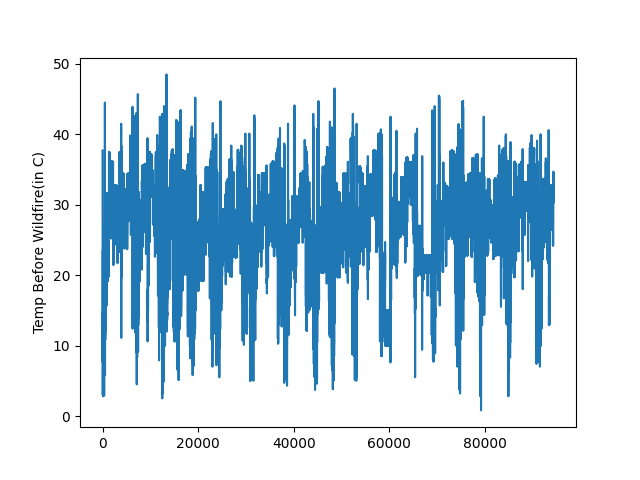
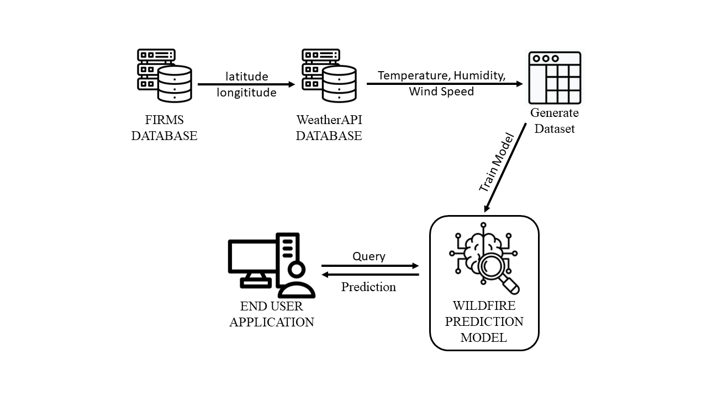
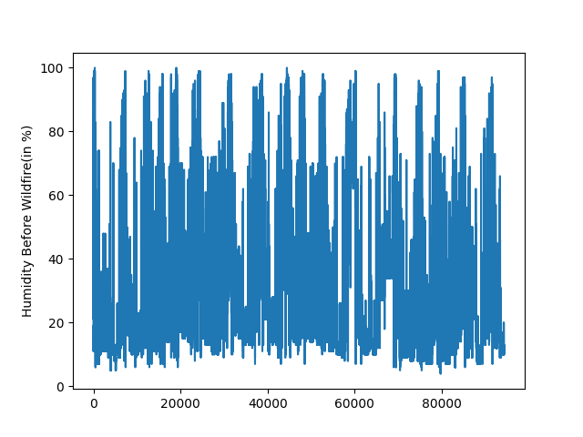
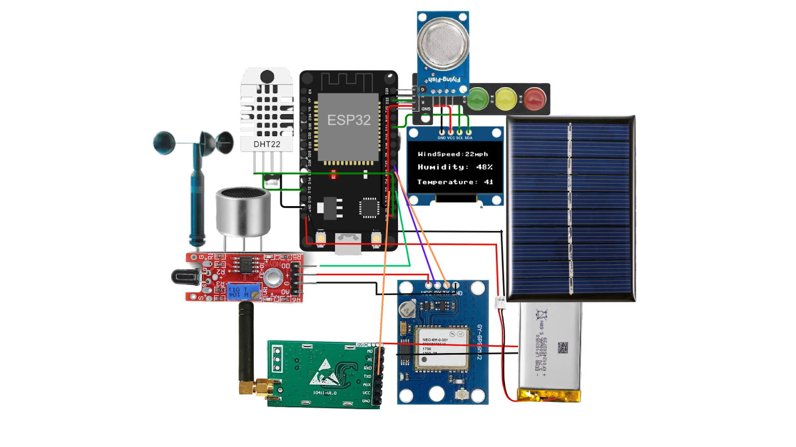

# FLAMINGO Wildfire Management System

## High-Level Summary

FLAMINGO is an advanced wildfire management system designed to detect wildfires early. We have developed an alert system that leverages wildfire data from on-field devices, user reports, and NASA's satellite data. To enhance usability, we've integrated a 3D visual representation of fire positions over time. Our application provides real-time active fire data and predictions using machine learning, delivering valuable insights to various stakeholders on the timing and location of early responses. Our primary goal is to reduce the impact of devastating wildfires and protect the lives of all living creatures. We firmly believe that these efforts will contribute to making the world a better place.

## Project Demo

You can watch a demo of our project on [YouTube](https://youtu.be/NhSnjr2lW-Y?feature=shared).

## Final Project Submission to NASA

Visit our [Space Apps Challenge page](https://www.spaceappschallenge.org/2023/find-a-team/team-proshphut/?tab=project) for our final project submission.

## Project Details

### Overview

As a part of Team Proshphut, we have dedicated the last 18 months to developing impactful solutions for urgent global issues. Our latest project addresses the escalating problem of wildfires, a disaster that wreaks havoc on human lives, wildlife, and property.

### Problem Details

Over the past five years, the severity of wildfires has dramatically escalated. The Amazon forest, often referred to as the Earth's lungs, was nearly obliterated by a fire. In 2020, wildfires in California ravaged over 4.3 million acres. In 2022 alone, these uncontrollable blazes consumed 69,000 acres of land. The delayed detection of these fires often leads to devastating losses of life and property. From 2000 to 2018, wildfires have impacted over 500 species that are either threatened or endangered and are responsible for 20–25% of global carbon emissions.

### Solution Overview

To address this issue, we have developed an application with three core functionalities: Detection, Alert, and Response. Our goal is to predict potential wildfires as accurately as possible using a machine learning model, detect wildfires on the ground through our concept device and crowd-sourced data, and promptly alert vulnerable individuals, even if they reside in remote areas, to protect lives and belongings.

### Detailed Solution

#### 1. Detection Method:
   We've established a robust method for detecting wildfires, which involves a machine-learning model. This model is trained on approximately 200,000 data points derived from NASA's open-source data with the assistance of a weather API. It considers key parameters such as temperature, humidity, and wind speed, gathered from open-source weather data and satellites like MODIS and VIIRS. By analyzing historical data and current conditions, our model can estimate the probability of a wildfire occurring in a particular region.

   [Dataset Link](https://www.kaggle.com/datasets/nixondebantu/weather-and-wildfire/data)

   
   *Fig: A graph representing temperature before wildfire*

   
   *Fig: The working flow of the trained model*

   
   *Fig: Humidity level (in %) before wildfire for all data points*

#### 2. On-Ground Monitoring Devices

In addition to the ML model, we've designed a network of monitoring devices to be distributed among forests in a 5km circular diameter. These devices are equipped with sensors that continuously monitor humidity, temperature, and other relevant environmental factors. If a fire is detected on the spot, these devices can trigger alerts within seconds. This on-ground monitoring network ensures real-time data collection and rapid response.

*Fig: Device Circuit Diagram*

#### 3. Alert System

We've implemented a three-tier sensory alert system to notify potentially affected people quickly. The alerts are sent via the mobile app, ensuring that individuals receive timely warnings. The tiers provide varying levels of urgency based on the proximity and severity of the detected wildfire, helping users make informed decisions about evacuations or protective measures.

Moreover, in critical situations, our on-ground monitoring device will produce an ultrasound signal to alert animals in the forest eventually.

#### 4. Community Reporting

We encourage local residents to actively participate in wildfire reporting. Their reports are validated using NASA's live satellite data, enhancing the accuracy of our system. Community involvement is crucial in providing real-time information from the ground, complementing satellite-based detection.

#### 5. 3D Visual Display

To make our system more appealing and informative, we've integrated a 3D visual effect within the app. This feature displays probable fire locations over time, helping users visualize the progression and potential impact of wildfires in their vicinity.

#### 6. Community Forum

Our platform serves as a forum where community members can alert others about natural disasters or initiate relief collection efforts. This collaborative space fosters community resilience and enables swift responses to evolving wildfire situations.

#### 7. AI Chatbot

To assist in critical situations, we've developed an AI chatbot that can provide important guidance to people even in areas with no network connectivity. This ensures that individuals have access to essential information and safety instructions during emergencies.

#### 8. Radio Alerts

For those in areas with no network connectivity, our system sends radio alerts to the affected area, providing vital information about the wildfire's location and safety recommendations.

[Link to our Radio Alert UI](https://tinyurl.com/project-flamingo-radio)

## What Impact Does It Have?

While our solution may not extinguish forest fires, it will undoubtedly mitigate the impact on both wealth and life. Our system dramatically reduces detection and response times to mere minutes, making an enormous difference in the aftermath of wildfires. This is our commitment to safeguarding the world we share.

## Future Upgradation

In the future, we aspire to develop a more accurate machine-learning model with a significantly higher success rate. Furthermore, we have plans to deploy our concept monitoring device in real-life scenarios. We aim to design our system to be more accessible to people without network connectivity, utilizing satellite communication.

## HACKATHON JOURNEY

Our hackathon journey was truly mesmerizing, a chapter that will be etched in our memories for years to come. Along the way, we encountered numerous challenges and faced moments of uncertainty, but we never wavered in our determination. In the end, our unwavering dedication paid off, teaching us an invaluable life lesson: to never lose hope. This journey was nothing short of an expedition.

Thanks to the NASA Space App Challenge committee for organizing this event. Special thanks to the local organizer, Space App Bangladesh Committee, for creating a creative and friendly environment for the participants.

## Tools, Language, and Hardware

- Machine Learning: Python, Kaggle
- Apps: Dart, Flutter, Firebase
- Web: HTML, CSS, Bootstrap
- On-ground Monitoring Device: Micro-controller (ESP32), Anemometer, Flame Sensor, Gas Sensor, Temperature and Humidity Sensor, Transmitter Module

## USE OF ARTIFICIAL INTELLIGENCE

We have used an AI-powered chatbot that provides guidance and support to end users even without network connectivity. This chatbot helps users access important fire-related information in critical situations.

## SPACE AGENCY DATA

- [FIRMS - Fire Information for Resource Management System (FIRMS)](https://firms.modaps.eosdis.nasa.gov/space-apps-2023)
- [Worldview Earthdata](https://worldview.earthdata.nasa.gov/)

## REFERENCES

- [Weather API](https://www.weatherapi.com/)
- [OpenAI API](https://openai.com/product)
- [Open Street Map](https://www.openstreetmap.org/)

